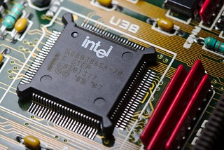
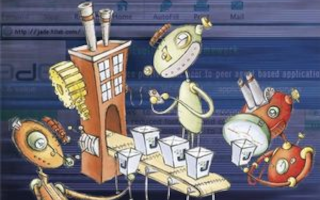
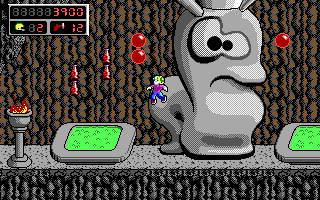
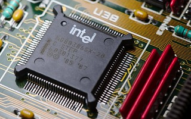

## Hi, I'm Francesco Bianco 👾

> Software Enginner at <a href="https://www.javanile.org">Javanile</a>  
> Solutions Architect at <a href="https://www.opencrmitalia.com">Opencrmitalia</a>  
> Content Director at <a href="https://hardcode.blog">HARDCODE.BLOG</a>

Stay connected with me on social media!

[![Linkedin: francescobianco](https://img.shields.io/badge/-Francesco%20Bianco-blue?style=for-the-badge&logoColor=white&link=https://www.linkedin.com/in/yafb/&logo=data:image/svg+xml;base64,PHN2ZyB4bWxucz0iaHR0cDovL3d3dy53My5vcmcvMjAwMC9zdmciIHNoYXBlLXJlbmRlcmluZz0iZ2VvbWV0cmljUHJlY2lzaW9uIiB0ZXh0LXJlbmRlcmluZz0iZ2VvbWV0cmljUHJlY2lzaW9uIiBpbWFnZS1yZW5kZXJpbmc9Im9wdGltaXplUXVhbGl0eSIgZmlsbC1ydWxlPSJldmVub2RkIiBjbGlwLXJ1bGU9ImV2ZW5vZGQiIHZpZXdCb3g9IjAgMCA1MTIgNTEyIj48cGF0aCBmaWxsPSIjZmZmIiBkPSJNNDc0LjkxOSAwSDM4LjU5MkMxNy43MiAwIDAgMTYuNTA0IDAgMzYuODQxVjQ3NS4xNEMwIDQ5NS40OTYgMTEuNjI5IDUxMiAzMi40OTIgNTEyaDQzNi4zMjdDNDg5LjcxOCA1MTIgNTEyIDQ5NS40OTYgNTEyIDQ3NS4xNFYzNi44NDFDNTEyIDE2LjUwNCA0OTUuODA5IDAgNDc0LjkxOSAwek0xOTUuMDQzIDE5NS4wNDNoNjguOTI4djM1LjEzNmguNzU1YzEwLjUwNS0xOC45NDUgNDEuNTQxLTM4LjE3NyA3OS45MjEtMzguMTc3IDczLjY1NSAwIDk0LjIxNCAzOS4xMDggOTQuMjE0IDExMS41Mzh2MTM1LjMyMWgtNzMuMTQ4VjMxNi44ODNjMC0zMi40MjctMTIuOTQ3LTYwLjg4My00My4yMjctNjAuODgzLTM2Ljc2OCAwLTU0LjI5NSAyNC44ODktNTQuMjk1IDY1Ljc1OHYxMTcuMTAzaC03My4xNDhWMTk1LjA0M3pNNzMuMTM5IDQzOC44NjFoNzMuMTQ4VjE5NS4wNDNINzMuMTM5djI0My44MTh6bTgyLjI4OS0zMjkuMTQ4YzAgMjUuMjU4LTIwLjQ1NyA0NS43MTUtNDUuNzE1IDQ1LjcxNS0yNS4yNTggMC00NS43MTUtMjAuNDU3LTQ1LjcxNS00NS43MTUgMC0yNS4yNTggMjAuNDU3LTQ1LjcxNSA0NS43MTUtNDUuNzE1IDI1LjI1OCAwIDQ1LjcxNSAyMC40NTcgNDUuNzE1IDQ1LjcxNXoiLz48L3N2Zz4=)](https://www.linkedin.com/in/yafb/)

If you ❤️ open source, consider becoming my sponsor on GitHub. Your small 💸 contribution will help me continue developing open-source software like 🌟
[Mush](https://github.com/javanile/mush),
[Yamlinc](https://github.com/javanile/yamlinc),
[Vtiger](https://github.com/javanile/vtiger), etc...

  

    <strong>Discover more about me</strong>
  

This is a carefully curated list of items that have had a significant impact on me and my professional journey. These are things that have fascinated me, inspired me, and shaped my thinking in meaningful ways.

<kbd></kbd>

